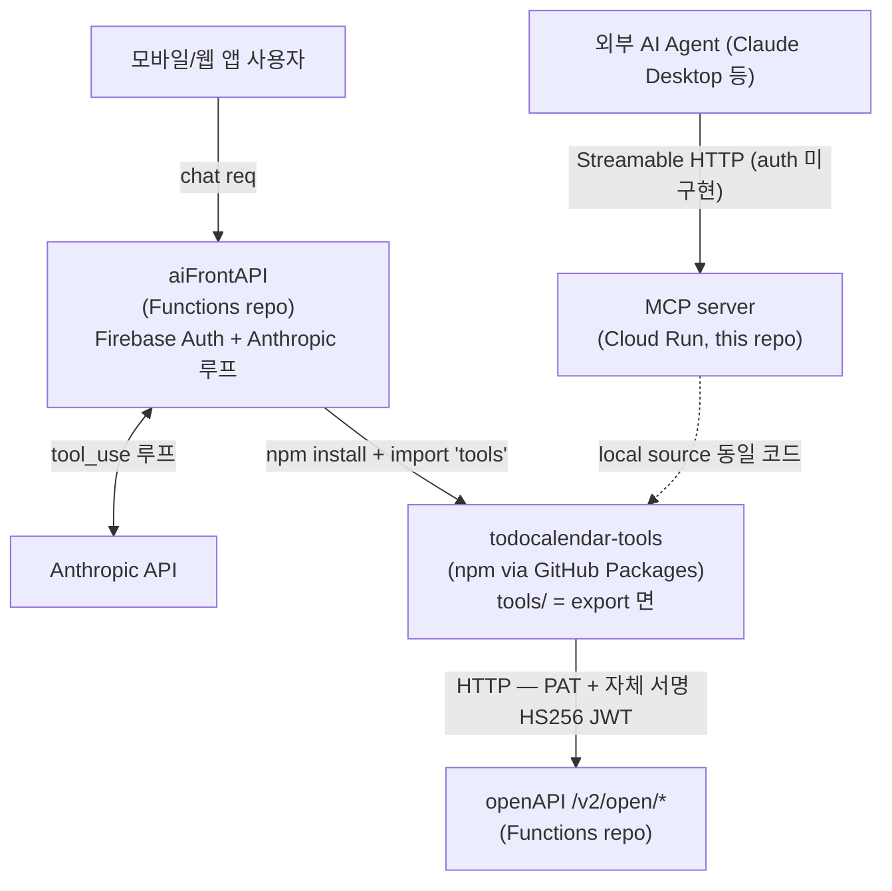

# CLAUDE.md

This file provides guidance to Claude Code (claude.ai/code) when working with code in this repository.

## Project status

현재 저장소는 greenfield — 코드는 아직 없고 설계만 확정돼 있다. 전체 사양은 [issue #1](https://github.com/sudopark/TodoCalendar-mcp/issues/1)이 source of truth이며, 구현 결정이 충돌하면 issue를 우선한다.

## What this is

AI Agent가 TodoCalendar의 todo / schedule / tag 데이터를 다룰 수 있도록 노출. 자체 비즈니스 로직 없음 — userId 강제·CONFIRM·AI 친화 변환 후 sibling 레포 `sudopark/TodoCalendar-Functions`의 openAPI를 호출하는 얇은 어댑터.

두 종류의 호출자:

- **외부 AI Agent** (Claude Desktop 등): MCP server를 Streamable HTTP로 호출. **auth는 미구현 상태로 첫 배포** — 향후 OAuth 추가.
- **first-party** (`aiFrontAPI` 서버사이드 AI 호스트): tool 함수를 npm 라이브러리로 직접 import — MCP transport 우회.

## Architecture



같은 `tools/` 코드가 두 진입점(외부 AI Agent → MCP server transport, first-party → aiFrontAPI lib import)에서 공유. 둘 다 결국 openAPI를 호출.

## Stack

- Node.js 22+, TypeScript
- MCP SDK: `@modelcontextprotocol/sdk`
- Transport: Streamable HTTP
- 호스팅: **Cloud Run**
- JWT: `jsonwebtoken` (**Firebase Admin SDK 의존 금지** — 아래 §2)

## Two artifacts in this repo

| 산출물 | 배포처 | 소비자 |
|---|---|---|
| **MCP server** | Cloud Run | 외부 AI Agent (auth 추가 후) |
| **npm library** (`todocalendar-tools`) | GitHub Packages | `TodoCalendar-Functions/aiFrontAPI` |

운영: 단일 버전, 단일 릴리스. `git tag vX.Y.Z` → CI 두 잡 병렬 (`npm publish` + `gcloud run deploy`).

`package.json` `exports`가 외부 공개 면 — **`tools/`만** 노출. `server.ts`, `openapi/`, `confirm/`, `auth/`, `middleware/` 등 나머지는 전부 비공개. openapi 클라이언트나 confirm 토큰 모듈은 tool 안에서만 쓰이고, 직접 노출하면 다운스트림이 tool 레이어를 우회할 위험.

서버는 자기 코드를 로컬 import (`./tools/...`)로 쓴다 — published lib을 자기가 install하지 않는다.

## Commands

`package.json`은 아직 없음. 스캐폴드 후 일반적으로 `npm install` / `npm run build` (tsc) / `npm test` / `npm run lint`. 배포는 CI가 git tag로 트리거.

## Architectural constraints (non-obvious — 반드시 준수)

이 결정들은 보안·레포 분리·다운스트림 호환과 직결되므로 임의로 바꾸지 말 것. 변경이 필요하면 issue에서 먼저 합의.

### 1. JWT 검증 시 algorithm·issuer 화이트리스트 명시

`algorithms: ['RS256']` + `issuer: 'mcp-oauth'`. 알고리즘 confusion attack 차단. 단일값이지만 명시 의무.

### 2. Firebase Admin SDK 도입 금지

Firebase Auth 검증은 aiFrontAPI가 흡수한다. MCP는 Firebase를 직접 검증하지 않음. 의존성 다시 끌어오면 레포 분리 전제가 깨진다.

### 3. userId는 항상 검증된 토큰의 `sub`에서만 추출

Tool 인자(`request.params.arguments`)로 userId 받지 말 것 — Claude가 임의 변조 가능. `auth.userId`만 사용. lib 직접 호출 경로(aiFrontAPI)에서도 동일 — 호출자가 `auth` context를 만들어 넘기고 args 안 userId는 무시.

### 4. openAPI 호출 시 헤더 두 개 항상 동시

- `Authorization: Bearer mcp_<secret>` (서비스 인증, env `OPENAPI_PAT_MCP`. 형식 `<service>_<secret>`, MVP 화이트리스트는 `mcp` 한 종류)
- `x-open-user-token: <userJwt>` — `SIGNING_SECRET`으로 HS256 자체 서명. payload `{ sub: auth.userId, scope: ['read:calendar', 'write:calendar'] }`

scope claim 빠지면 openAPI가 403 `InsufficientScope` 반환. forward 개념 없음 — 호출자(MCP server / aiFrontAPI lib)가 항상 자기가 서명.

### 5. 삭제·대량 수정은 CONFIRM 강제

즉시 실행 X — 첫 호출에 `confirmToken` (HMAC, 5분 TTL) 발급, 클라가 confirmToken으로 재호출하면 실행. 대상: `delete_todo`, `delete_schedule` (issue #1 §2.4). lib 직접 호출 경로에도 동일 적용.

### 6. AI 친화 변환은 Tool 레이어 책임

openAPI는 시멘틱 raw 데이터만 노출 (timestamp 숫자, 원본 필드명, 에러 코드). Tool에서 `output_schema` 정의 시 ISO 8601 변환, 필드명 단순화, 에러 메시지 자연어화를 책임진다.

### 7. Library export 면을 좁게 유지, breaking은 major 버전

`exports`에 노출된 모듈은 `aiFrontAPI`가 핀하므로 함부로 깨면 다운스트림이 부러진다. 시그니처 / 타입 / 반환 구조 변경은 semver major. 서버 내부는 export 안 하므로 자유롭게 변경.

## Layer flow

```
[외부 AI Agent — MCP transport]
  → MCP server: Streamable HTTP 수신
  → (auth middleware는 추후 OAuth 추가 시) → { userId } 반환
  → tools[name].execute(auth, args)        // userId는 auth에서만, args 무시
  → openapi/client.callOpenApi(auth, ...)  // PAT + 자체 서명 HS256 JWT 주입

[first-party — npm library import, MCP 우회]
  aiFrontAPI 안에서:
  → Firebase Auth 검증 → userId 획득
  → import { ... } from 'todocalendar-tools/tools'
  → 같은 tools[name].execute({ userId }, args) 직접 호출
  → openapi/client.callOpenApi(...)
```

`tools[name].execute(auth, args)` 시그니처·동작이 두 경로에서 동일. transport만 다름.

## Environment variables

- `OPENAPI_BASE_URL` — openAPI 호출 base
- `OPENAPI_PAT_MCP` — openAPI 서비스 인증 PAT
- `SIGNING_SECRET` — openAPI client가 user JWT 서명에 사용 (HS256, aiFrontAPI / openAPI와 공유)
- `MCP_OAUTH_PRIVATE_KEY` / `MCP_OAUTH_PUBLIC_KEY` — OAuth 추가 시 RS256 발급·JWKS 노출용

## Cross-repo dependencies

이 레포 단독으로는 동작 불가 — integration은 Functions 레포 emulator 위에서.

- `sudopark/TodoCalendar-Functions#152` — openAPI MVP (호출 대상)
- `sudopark/TodoCalendar-Functions#D` — aiFrontAPI (서버사이드 AI 호스트, `todocalendar-tools` lib 소비자)
- `sudopark/TodoCalendar-Functions#151` — AI 기능 전체 설계 (parent issue)

openAPI 스펙 source of truth: `TodoCalendar-Functions/functions/swagger/swagger.yaml` (`/v2/open/*` 경로 + components.schemas 모델 + 에러 모델 `{status, code, message}`. 코드 카탈로그: `InvalidParameter`(400) / `NotFound`(404) / `InsufficientScope`(403))
