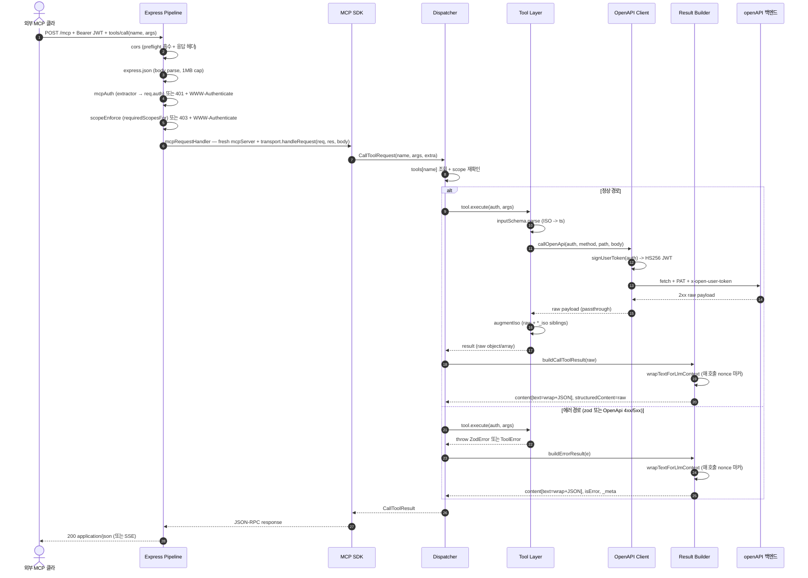

# Request Flow

외부 MCP 클라(Claude Desktop 등)가 `tools/call` 한 사이클을 보낼 때 객체·레이어가 어떻게 협력하는지 정리한다. first-party 경로(aiFrontAPI가 lib을 직접 import)는 §[First-party 경로](#first-party-경로) 참고.

CLAUDE.md의 [Architecture](../CLAUDE.md#architecture)가 high-level 그림이고, 본 문서는 한 호출의 객체 시퀀스를 다룬다.

## 시퀀스 다이어그램 — 외부 MCP 클라 경로



Express Pipeline 내부의 self-loop 네 줄은 `app.post('/mcp', cors, express.json, mcpAuth, scopeEnforce, mcpRequestHandler)` 체인이다. 앞 단계가 응답을 종료하면 (401/403/413/400) 뒤 단계는 호출되지 않는다.

## 레이어별 책임

| 레이어 | 객체/파일 | 책임 |
| --- | --- | --- |
| HTTP App | `createHttpServer` (`src/server.ts`) | Express app 조립 — `cors` / `express.json` / 라우팅 / 404 / 405 / `jsonRpcErrorHandler` |
| WWW-Authenticate util | `src/middleware/wwwAuthenticate.ts` | RFC 6750/7235 quoted-string escape + Bearer 헤더 builder + `metadataUrlFrom` |
| Auth 미들웨어 | `mcpAuth` + `extractOAuthAuth` / `extractDevAuth` (`src/middleware/auth.ts`) | extractor가 throw하면 reason별로 401 + `WWW-Authenticate`. 성공하면 `req.auth` 세팅 (token은 placeholder, `extra.userId`로 propagate) |
| Scope 미들웨어 | `scopeEnforce` + `requiredScopesFor` (`src/middleware/scope.ts`) | body 파싱된 후 `tools/call`의 required scope 계산. `auth.scopes`와 비교, 부족 시 403 + `WWW-Authenticate insufficient_scope` |
| MCP Handler | `mcpRequestHandler` (`src/mcp/handler.ts`) | per-request fresh `mcpServer` + `transport` + `res.on('close')` cleanup. DNS rebinding 보호 옵션은 SDK transport에 위임 |
| MCP SDK | `StreamableHTTPServerTransport` + `Server` | JSON-RPC envelope·세션 헤더·request routing |
| Dispatcher | `CallToolRequestSchema` handler (`src/mcp/server.ts:67`) | tool 조회·`resolveAuth(extra)`·scope 재확인·exception → `buildErrorResult` 매핑 |
| Tool | `ToolDefinition.execute` (`src/tools/*`) | `inputSchema.parse`·ISO→ts 변환·CONFIRM 게이트·`callOpenApi` 호출·`augmentIso`로 `*_iso` sibling 첨가 |
| OpenAPI Client | `callOpenApi` (`src/openapi/client.ts:93`) | `signUserToken`(HS256)·PAT 헤더·timeout/retry·4xx/5xx → `OpenApiError` |
| Result Builder | `buildCallToolResult` / `buildErrorResult` (`src/mcp/result.ts`) | raw payload는 `structuredContent`/`_meta`에 그대로, LLM이 보는 `content[0].text`만 `wrapTextForLlmContext`(nonce 마커)로 wrap |

## 핵심 흐름 포인트

- **userId는 검증된 토큰의 `sub`에서만** — `mcpAuth`가 extractor 결과의 `userId`를 `req.auth.extra`에 세팅. SDK가 dispatcher에 `extra.authInfo`로 propagate. `req.params.arguments` 안의 userId는 dispatcher가 무시 (CLAUDE.md §3).
- **scope는 두 번 검사** — Express 단(`scopeEnforce`)에서 403 + `WWW-Authenticate`, dispatcher 단에서 다시 확인. 보호망 이중화로 한쪽이 잘못 와이어링돼도 다른 쪽이 막음.
- **`tool.execute()` 시그니처는 transport-agnostic** — first-party(`aiFrontAPI`)는 Express Pipeline·MCP SDK·Dispatcher·Result Builder를 건너뛰고 `tool.execute(auth, args)`를 직접 호출. result wrap도 Result Builder를 거치는 외부 클라 경로에서만 일어나고, lib 호출자는 raw object 그대로 받음.
- **raw passthrough** — Backend 응답은 `augmentIso`로 `*_iso` sibling만 추가될 뿐 ts/userId 등 원본 필드는 보존. `buildCallToolResult`도 `structuredContent`에 raw 그대로 넣음. text 채널만 wrap (CLAUDE.md §6).
- **에러 응답 분리** — 미들웨어 단계 throw는 `jsonRpcErrorHandler`가 잡아 `entity.too.large` → 413 / `entity.parse.failed` → 400 / 기타 fallback 500. fallback은 `err.message`를 body에 노출 안 하고 `console.error`로 서버 로그에만 남김 (token 검증 내부 정보 leak 방지).

## openAPI 호출 헤더 두 개

`callOpenApi`는 항상 두 헤더를 동시에 박는다 (CLAUDE.md §4).

| 헤더 | 값 | 의미 |
| --- | --- | --- |
| `Authorization` | `Bearer mcp_<secret>` | 서비스 인증 PAT (env `OPENAPI_PAT_MCP`) |
| `x-open-user-token` | `<userJwt>` | `signUserToken(auth)` — HS256 자체 서명. payload `{ sub: auth.userId, scope: ['read:calendar','write:calendar'] }` |

scope claim 빠지면 openAPI가 403 `InsufficientScope` 반환.

## CONFIRM 게이트 (delete 류)

`delete_todo` / `delete_schedule` 등 파괴적 tool은 두 단계.

1. 첫 호출: `confirmToken` 없이 → Tool이 `buildConfirmRequired(...)` 반환 → Result Builder가 `{ status: 'confirm_required', message, confirmToken, action, target }`로 감쌈. backend 미호출.
2. 두 번째 호출: 클라가 `confirmToken` 동봉해 재호출 → Tool이 `ensureConfirmToken(...)`로 HMAC·TTL(5분) 검증 후 실제 backend 호출 → `{ status: 'ok' }`.

토큰은 stateless — 같은 args·같은 user·5분 안이면 재사용 가능. intent가 바뀌면 새로 발급. 자세한 건 [src/tools/shared/confirm.ts](../src/tools/shared/confirm.ts).

## First-party 경로

`aiFrontAPI`는 lib을 직접 import해서 Express Pipeline·MCP SDK·Dispatcher·Result Builder를 우회한다.

```
[aiFrontAPI in Functions repo]
  Firebase Auth 검증 → { userId, scopes }
  → import { tools, type Auth } from 'todocalendar-tools/tools'
  → tools[name].execute(auth, args)        // 같은 ToolDefinition
  → callOpenApi(...)                        // 같은 클라이언트
  ← raw object (wrap 없음)
  → aiFrontAPI가 자체적으로 LLM-facing tool_result 구성 (Functions #159가 가드 적용 책임)
```

- 같은 `tool.execute()` — 시그니처·동작 transport와 무관 (CLAUDE.md §7 export 면).
- `auth` context는 호출자(aiFrontAPI)가 만들어 넘김. `args` 안 userId는 외부 클라 경로와 동일하게 무시.
- result wrap은 lib에서 안 함. Functions #159가 `agentLoopService`에서 동일 정책(nonce 마커 wrap) 별도 적용.

## 코드 진입점 빠른 색인

| 흐름 단계 | 진입점 |
| --- | --- |
| HTTP App 조립 | `src/server.ts:createHttpServer` |
| WWW-Authenticate util | `src/middleware/wwwAuthenticate.ts` |
| Auth 미들웨어 (extractor + Express wrap) | `src/middleware/auth.ts:mcpAuth`, `extractOAuthAuth`, `extractDevAuth` |
| OAuth Bearer 검증 (JWKS) | `src/auth/oauthVerify.ts` |
| Scope 미들웨어 | `src/middleware/scope.ts:scopeEnforce`, `requiredScopesFor` |
| MCP per-request handler | `src/mcp/handler.ts:mcpRequestHandler` |
| MCP server 구성·dispatch | `src/mcp/server.ts:createMcpServer` |
| Tool 정의 (24개) | `src/tools/*.ts`, 레지스트리 `src/tools/index.ts` |
| ISO ↔ ts 변환·augment | `src/tools/shared/schemas.ts`, `src/tools/shared/time.ts` |
| CONFIRM 게이트 | `src/tools/shared/confirm.ts` |
| openAPI 호출 | `src/openapi/client.ts:callOpenApi` |
| 에러 매핑·자연화 | `src/openapi/errors.ts`, `src/tools/shared/errors.ts:naturalizeToolMessage` |
| Result wrap | `src/mcp/result.ts:wrapTextForLlmContext`, `buildCallToolResult`, `buildErrorResult` |
